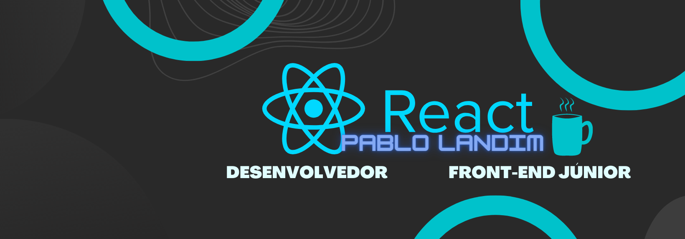

Prazer sou Pablo,
Sou casado, muito feliz com uma mulher linda, maravilhosa e batalhadora, temos dois filhos!!!
Trabalhei desde 2008 vendendo e instalando o serviço de rastreador veicular, onde apliquei muita negociação e comunicação!!

Durante o percurso até aqui, por vontade, curiosidade e gosto, fiz o curso de academia do programador e após, realizei também o curso de linguagem e plataforma Java, conheci então o poder da tecnologia. 
Atualmente, estudando na Trybe, pude então aplicar as principais tecnologias: 

Front-end, React, Node, HTML, JS, CSS, Git-Hub!!

Acesse meu Linkedin

https://www.linkedin.com/in/pablolandimdesadev/

